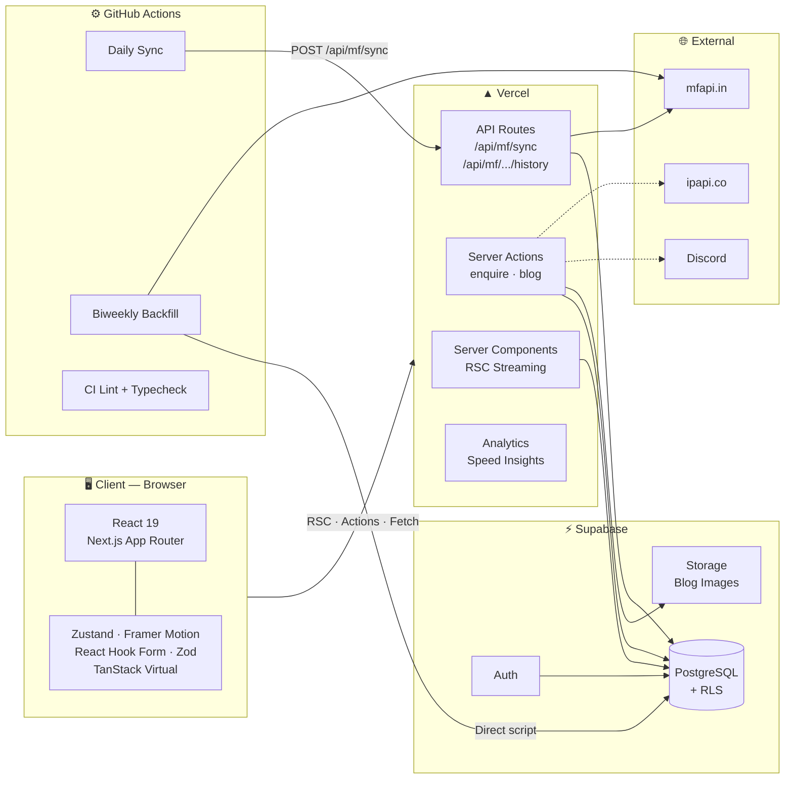
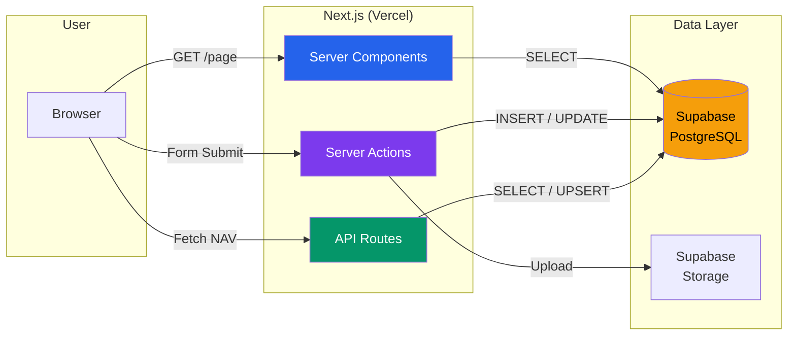
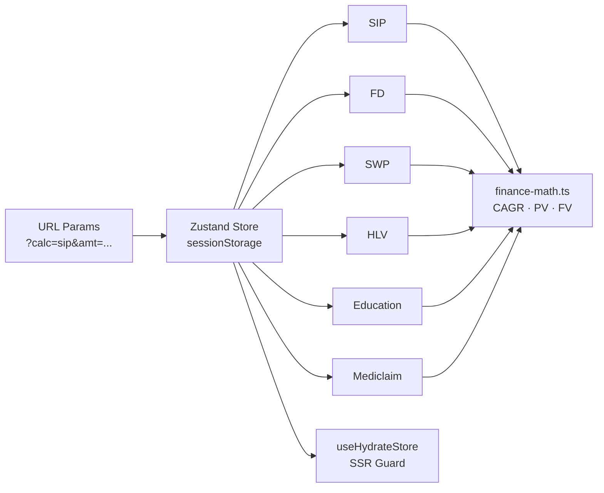
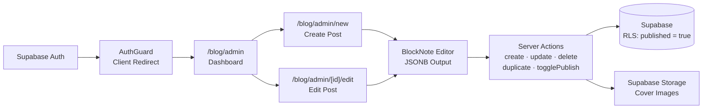
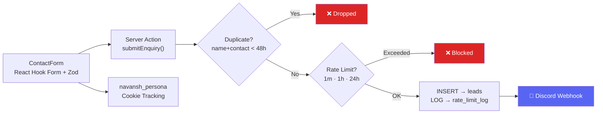
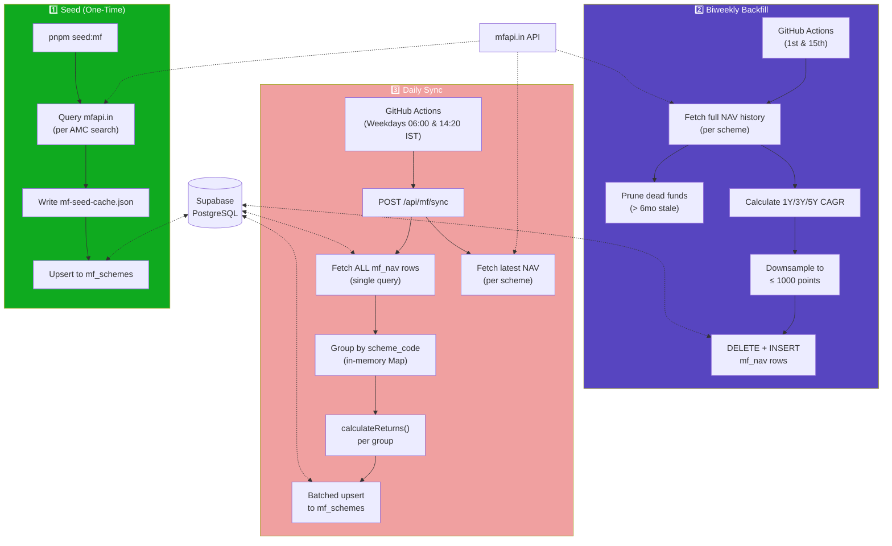
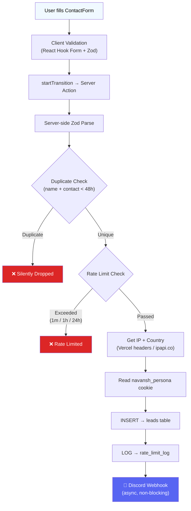
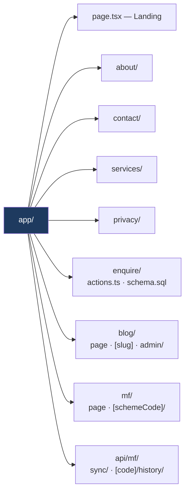
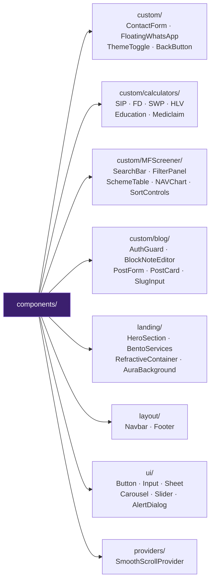
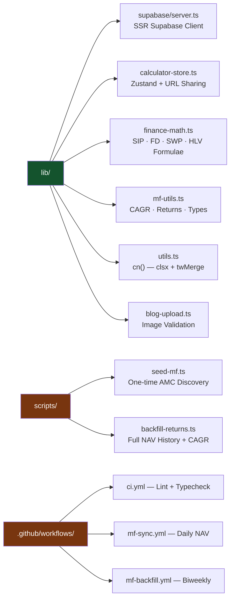

# Navansh Finserv

A high-performance lead-generation platform and financial tools portal. Engineered to capture client intents, handle complex client-side financial computations, and maintain a synchronized mutual fund database with zero manual intervention.

> Visit live website @ [navansh.in](https://navansh.in)

## Tech Stack
- **Framework**: Next.js 16.1 (App Router) + React 19
- **Language**: TypeScript 5
- **Styling**: Tailwind CSS 4 + Shadcn UI / Radix UI Primitives
- **State Management**: Zustand (Persisted via `sessionStorage`)
- **Database & Auth**: Supabase (PostgreSQL, Auth, Storage)
- **Forms**: React Hook Form + Zod
- **Editor**: BlockNote (Internal Blog CMS)
- **Charts / UI**: Recharts, Framer Motion, Embla Carousel

## Architecture Diagrams

### System Overview

### Request & Data Flow

### Feature Architecture Map

#### Financial Calculators

#### Blog CMS

#### Enquiry System

### Mutual Fund Data Pipeline

### Enquiry / Lead Pipeline

### Folder Structure (Layered View)

#### `app/` — Pages, API Routes & Server Actions

#### `components/` — UI Layer

#### `lib/` & `scripts/` & `.github/` — Logic, Pipelines & CI

## Core Architecture & Features

### 1. [Lead Generation & Rate Limiting](docs/enquiry-system.md)
- **Enquiry Pipeline**: Server actions handle form submissions natively (`app/enquire/actions.ts`), paired with Zod validation. 
- **Spam Prevention**: Multi-tier rate limiting (1 min, 1 hr, 24 hr thresholds) enforced via a Supabase `rate_limit_log` table. Captures client IPs and geolocation (`x-vercel-ip-country`). Identifies and blocks duplicate submissions within 48 hours.
- **Alerts**: Dispatches rich Discord webhook notifications on successful lead captures, including UTM/Persona tracking (`navansh_persona` cookie).

### 2. [Financial Calculators](docs/calculators.md)
- **Tools Available**: SIP, SWP, FD, HLV, Mediclaim, and Education Inflation.
- **State Sync**: Uses Zustand with a custom hydration guard (`useHydrateStore`) to prevent Next.js SSR mismatches.
- **Shareability**: Granular state management supports URL-based restoration (`?calc=sip&amt=...`), allowing agents and users to share pre-filled calculation states.

### 3. [Mutual Fund Screener & Automated Data Pipeline](docs/mutual-funds.md)
- **Screener UI**: Filters by AMCs, categories, and sorts by CAGR. Employs `@tanstack/react-virtual` to maintain 60fps scrolling on large scheme tables.
- **Data Pipeline** (three-tier automation):
  - **Seed** (`scripts/seed-mf.ts`): One-time discovery of all schemes for configured AMCs via the mfapi.in search endpoint. Writes a local JSON cache (`scripts/mf-seed-cache.json`) so failed Supabase upserts can be replayed with `--from-cache`.
  - **Biweekly backfill** (GitHub Actions `mf-backfill.yml`, 1st & 15th of each month): Runs `scripts/backfill-returns.ts` directly on a CI runner. Fetches the complete NAV history per scheme, calculates 1Y/3Y/5Y CAGR from the full dataset, downsamples to ≤ 1,000 points/scheme (to stay within Supabase's PostgREST row limit), and replaces stored rows via DELETE + INSERT. Prunes dead funds (no NAV update > 6 months).
  - **Daily sync** (GitHub Actions `mf-sync.yml`, weekdays at 06:00 & 14:20 IST): Triggers `POST /api/mf/sync`. Fetches only the latest NAV per scheme and recalculates returns in a single batched upsert. Protected by `x-cron-secret`.
  - Both GH Actions workflows support a `workflow_dispatch` input to target **dev or prod** on demand.

### 4. [Blog CMS](docs/blog-cms.md)
- **Custom Admin**: Authenticated via Supabase (`/blog/admin`). Uses RLS to ensure public users only query `published = true` rows.
- **Editor**: Integrates `@blocknote/react` for block-based rich text editing, outputting JSON to the database.
- **Storage**: Image uploads are piped directly to Supabase storage buckets, validated server-side.

## Low-Level Architecture & Implementation

### 1. [Lead Intake & Rate Limiting Engine](docs/enquiry-system.md)
**Implementation:** Form submissions bypass standard API routes, using Next.js Server Actions (`app/enquire/actions.ts`) combined with Zod schemas for strict runtime type-safety and sanitization. 
**Security & Anti-Spam:**
Supabase `rate_limit_log` table acts as the gatekeeper. It tracks `x-vercel-ip-country` headers and client IPs to enforce multi-tier thresholds (1m, 1h, 24h). Duplicates within a 48-hour window are silently dropped.
**Delivery Pipeline:**
Successful leads trigger asynchronous Discord webhook payloads containing client data and `navansh_persona` cookie values for UTM attribution.

### 2. [Client-Side Computation (Calculators)](docs/calculators.md)
**Implementation:**
Six distinct calculators (SIP, SWP, FD, HLV, Mediclaim, Education) driven by a globally persisted Zustand store. State is cached in `sessionStorage`.
**Hydration & SSR:**
Utilizes a custom `useHydrateStore` hook to intentionally delay state injection until the component mounts, entirely bypassing Next.js hydration mismatch errors.
**Deep Linking:**
Calculators parse `window.location.search` (`?calc=sip&amt=...`) to dynamically seed the Zustand store, enabling instant state-sharing for agents.

### 3. [Mutual Fund Data Pipeline & DOM Recycling](docs/mutual-funds.md)
**Ingestion & Processing (layered automation):**
- **Seed** (`pnpm seed:mf`): Discovers schemes via targeted search queries against mfapi.in (15-result cap bypassed with multiple queries per AMC). Deduplicates and upserts into Supabase. Writes `scripts/mf-seed-cache.json` for crash recovery (`--from-cache` flag replays upserts without re-hitting the API).
- **Biweekly backfill** (GitHub Actions `mf-backfill.yml`): Runs on the CI runner (not via HTTP — the script takes 5–10 min and is too heavy for a serverless function). Fetches the entire NAV history per scheme from mfapi.in, calculates CAGR from the full raw data, downsamples to ≤ 1,000 rows/scheme, and replaces stored rows (DELETE + INSERT). Dead fund pruning runs here. Targets prod on schedule; dev or prod selectable via `workflow_dispatch` input.
- **Daily sync** (GitHub Actions `mf-sync.yml` → `POST /api/mf/sync`): Lightweight — fetches only the latest NAV, fetches all `mf_nav` rows in one query, groups in-memory by `scheme_code` via a `Map`, computes 1Y/3Y/5Y CAGR with `calculateReturns()`, and pushes a single batched upsert to `mf_schemes`. Zero N+1 queries.

**UI Rendering:**
The frontend utilises `@tanstack/react-virtual` to recycle DOM nodes, allowing the screener to maintain 60fps scrolling while rendering hundreds of scheme rows.

### 4. [Blog CMS Internal Abstraction](docs/blog-cms.md)
**Implementation:**
A bespoke admin interface (`/blog/admin`) secured by Supabase Auth. Content is authored via `@blocknote/react`, which serializes rich text into structured JSON rather than raw HTML.
**Storage & Security:**
Images are uploaded directly to Supabase storage buckets. PostgreSQL Row Level Security (RLS) is strictly configured: unauthenticated users can only `SELECT` rows where `published = true`.

---

#### Contributing

Want to contribute? Read the [Contributing Guide](docs/CONTRIBUTING.md) for setup instructions, branch conventions, environment variables, and the full development workflow.

#### Developed and Maintained by [Anshuman Khunteta](https://www.linkedin.com/in/anshumankhunteta/)
