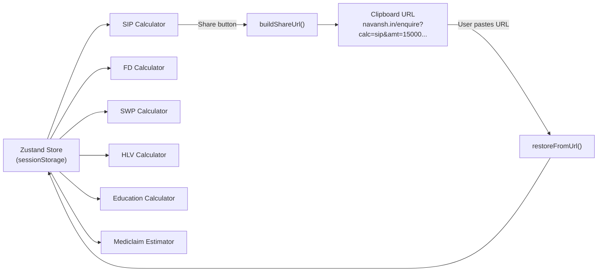

# Financial Calculators — Feature Documentation

> Six financial planning tools with persistent state, URL sharing, and goal-seek (reverse-solve) modes.

---

## Table of Contents

- [Overview](#overview)
- [Calculator Inventory](#calculator-inventory)
- [State Management](#state-management)
- [URL Sharing (Deep Links)](#url-sharing-deep-links)
- [Math Utilities](#math-utilities)
- [File Structure](#file-structure)
- [Gotchas & Notes](#gotchas--notes)

---

## Overview

The calculator suite provides six financial planning tools accessible from the landing page carousel and directly via `/enquire?calc=<key>`. Each calculator supports a standard "calculate" mode and most also support a "goal seek" (reverse-solve) mode where the user specifies a target and the tool computes the required input.

All calculator state is managed via a single Zustand store persisted to `sessionStorage`, with a custom hydration guard to avoid Next.js SSR mismatches.

---

## Calculator Inventory

| Calculator | Key | Standard Mode | Goal Mode | Formula |
|-----------|-----|---------------|-----------|---------|
| **SIP** | `sip` | Investment → Future Value | Target Amount → Required SIP | `FV = P × ((1+r)^n − 1) / r × (1+r)` |
| **FD** | `fd` | Principal → Maturity Amount | Target Amount → Required Principal | `A = P × (1 + r)^t` |
| **SWP** | `swp` | Corpus → Depletion Timeline | Monthly Withdrawal → Required Corpus | PV of annuity |
| **HLV** | `hlv` | Income/Expenses → Life Value | — | `(Income − Expenses) × 12 × Years + Liabilities` |
| **Education** | `education` | Current Cost → Future Cost | — | `FutureCost = Cost × (1 + inflation)^years` |
| **Mediclaim** | `mediclaim` | Age/Sum → Premium Estimate | — | Age-band base × SI multiplier × metro × PED |

### SIP Calculator Features

- **Frequency modes**: Daily, Weekly, Monthly, Yearly, Custom (N days), Lumpsum
- **Step-Up SIP**: Annual percentage increase in investment amount
- **Goal Mode**: Reverse-solves for the required investment given a target amount

### Mediclaim Estimator

- **Plan types**: Individual (sum of per-member premiums) or Floater (eldest-member-based with family scaling)
- **Member management**: Dynamic add/remove members with age and label
- **Modifiers**: Metro city (+15%), Pre-existing conditions (+25%)
- **Output**: Range estimate (±15%) with annual, monthly, and daily breakdown

---

## State Management

### Architecture



### Store Design

- **Single store, six slices**: `useCalculatorStore` contains `sip`, `fd`, `swp`, `hlv`, `education`, and `mediclaim` state objects.
- **Atomic setters**: Each slice has a dedicated setter (e.g., `setSip(partial)`) that merges partial updates.
- **Granular selectors**: Components select only their slice — `useCalculatorStore(s => s.sip.investmentAmount)` — so moving a slider in SIP won't re-render FD.
- **Persistence**: `zustand/persist` with custom `sessionStorage` adapter and `skipHydration: true`.

### Hydration Guard

```typescript
export function useHydrateStore() {
  const hydrated = useRef(false)
  useEffect(() => {
    if (!hydrated.current) {
      useCalculatorStore.persist.rehydrate()
      hydrated.current = true
    }
  }, [])
}
```

**Every client component reading the store MUST call `useHydrateStore()` first.** This delays rehydration until the component mounts on the client, preventing Next.js SSR hydration mismatches (the server has no `sessionStorage`).

---

## URL Sharing (Deep Links)

Calculators can be shared via URL. The share button copies a link like:

```
https://navansh.in/enquire?calc=sip&amt=15000&rate=12&yrs=20&freq=monthly&step=0
```

### URL Parameter Reference

**SIP**: `calc=sip&goal=0|1&amt=N&rate=N&yrs=N&freq=daily|weekly|monthly|yearly|custom|lumpsum&cdays=N&step=0|1&steppct=N&target=N`

**FD**: `calc=fd&mode=calculate|goal&amt=N&rate=N&inf=N&yrs=N&target=N`

**SWP**: `calc=swp&goal=0|1&corpus=N&wd=N&rate=N&yrs=N`

**HLV**: `calc=hlv&income=N&exp=N&yrs=N&liab=0|1&liabamt=N`

**Education**: `calc=education&cost=N&inf=N&yrs=N`

**Mediclaim**: `calc=mediclaim&plan=individual|floater&sum=N&metro=0|1&preex=0|1&members=Self:30,Spouse:28`

### How it works

1. `buildShareUrl(calcKey)` — reads current store state, serializes to URL search params
2. URL is copied to clipboard
3. When a user visits the URL, `restoreFromUrl(searchParams)` on the `/enquire` page parses params and calls the appropriate setter to populate the store

---

## Math Utilities

All financial formulas live in `lib/finance-math.ts`. Calculator components import these — they never contain inline math.

| Function | Purpose |
|----------|---------|
| `calcSIPFutureValue()` | Standard SIP future value with configurable frequency |
| `calcStepUpSIPFutureValue()` | Year-over-year step-up SIP with compounding |
| `calcLumpsumFV()` | Lumpsum future value |
| `calcSIPRequiredInvestment()` | Reverse SIP — required PMT for target FV |
| `calcStepUpSIPRequiredInvestment()` | Reverse step-up SIP (uses linearity trick: `target / FV(P=1)`) |
| `calcFDMaturity()` | FD maturity amount with annual compounding |
| `calcFDRequiredPrincipal()` | Reverse FD — required principal for target maturity |
| `calcInflationAdjusted()` | Real value of a future amount accounting for inflation |
| `calcEducationInflation()` | Future cost of education |
| `calcSWPDepletion()` | Month-by-month corpus depletion simulation (50-year cap) |
| `calcSWPRequiredCorpus()` | Reverse SWP — PV of annuity |
| `calcHLV()` | Human Life Value calculation |
| `estimateMediclaimPremium()` | Premium estimation with age bands, SI multipliers, metro/PED factors |
| `formatINR()` / `formatINRCompact()` | Indian currency formatting (`₹ 1,23,456` / `₹12.5L`) |

---

## File Structure

```
lib/
  calculator-store.ts         # Zustand store + URL serialize/parse
  finance-math.ts             # All financial formulas

components/custom/calculators/
  SIPCalculator.tsx           # SIP calculator (standard + step-up + goal)
  FDCalculator.tsx            # FD calculator (calculate + goal)
  SWPCalculator.tsx           # SWP / retirement burn rate calculator
  HLVCalculator.tsx           # Human Life Value calculator
  EducationInflationCalculator.tsx  # Education cost inflation projector
  MediclaimEstimator.tsx      # Health insurance premium estimator
  CalculatorActionButtons.tsx # Shared Share + Consult buttons

components/custom/
  CalculatorCarousel.tsx      # Embla carousel on landing page showing all calculators
```

---

## Gotchas & Notes

- **Zustand `persist` uses `sessionStorage`, not `localStorage`** — calculator state does not persist across browser tabs or sessions. This is intentional to avoid stale data.

- **`skipHydration: true` is critical** — without it, Zustand would try to rehydrate from `sessionStorage` during SSR (where `sessionStorage` doesn't exist), causing React hydration mismatches. The `useHydrateStore()` hook handles this by rehydrating only after mount.

- **SWP simulation caps at 600 months (50 years)** — if monthly withdrawal is less than or equal to monthly returns, the corpus never depletes. In this case, the calculator returns 600 months and the total withdrawal for that period.

- **Mediclaim estimates are ranges, not exact quotes** — the output includes `lowEstimate`, `midEstimate`, and `highEstimate` (±15%) to account for insurer variation. These are not actual premium quotes.

- **Step-up SIP reverse-solve uses a linearity trick** — since FV scales linearly with the initial investment P, the reverse calculation computes `FV(P=1)` first and then divides the target by that value. No iterative solver needed.

- **Share links always land on `/enquire`** — the URL format is `navansh.in/enquire?calc=sip&...`, not `/calculators/sip`. The enquiry page checks for `calc` in the URL params and restores the calculator state before rendering.

- **`formatINR` uses Indian numbering** — `₹ 1,23,456` not `₹ 123,456`. The `en-IN` locale handles lakh/crore comma placement.
