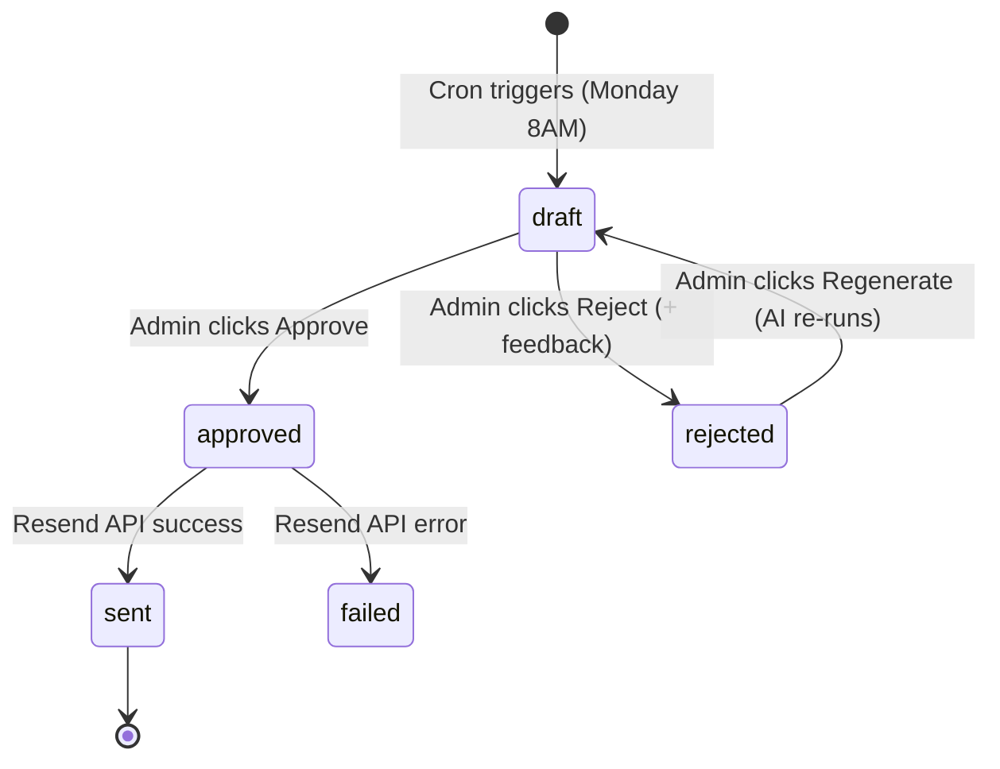

# AI Newsletter Feature — Low-Level Design (LLD)

## Overview
An automated, AI-generated weekly financial newsletter. It aggregates market news from Zerodha Pulse, combines it with internal blog posts and mutual fund data, generates a draft using Gemini 2.5 Flash, and allows admin review before batch-sending via Resend.

## Architecture Data Flow

1. **Subscription:** Client (`SubscribeInput.tsx`) → Server Action (`subscribeAction`) → DB (`subscribers`)
2. **Generation:** Vercel Cron (`/api/newsletter/generate`) → Gathers Context (`newsletter-pulse.ts` + DB) → Gemini API (`newsletter-ai.ts`) → Saves DB Draft (`newsletter_issues`)
3. **Review & Dispatch:** Admin Dashboard (`/admin/newsletter`) → Approve/Reject Action → Resend API (if approved) OR Gemini API (if rejected with feedback) → Updates DB Status

## Database Schema (Supabase)

### `subscribers`
Tracks user subscriptions. Uses RLS (Service Role only).
- `id` (UUID, PK)
- `email` (TEXT, UNIQUE)
- `is_active` (BOOLEAN, default: true)
- `subscribed_at` (TIMESTAMPTZ)
- `unsubscribed_at` (TIMESTAMPTZ, nullable)
- `source` (TEXT, default: 'hero')

### `newsletter_issues`
Tracks the lifecycle of each weekly digest. Uses RLS (Service Role only).
- `id` (UUID, PK)
- `subject` (TEXT)
- `content_json` (JSONB) - Structured sections generated by AI.
- `content_html` (TEXT) - Rendered React Email string (set upon approval).
- `admin_feedback` (TEXT) - Stores rejection feedback for the next prompt.
- `status` (TEXT) - Enum: `'draft' | 'approved' | 'sent' | 'failed' | 'rejected'`
- `recipient_count` (INT)
- `created_at` / `sent_at` (TIMESTAMPTZ)

## Key Modules

### 1. `lib/newsletter-pulse.ts` (News Aggregator)
- **Purpose:** Fetches `https://pulse.zerodha.com/` (server-side rendered HTML).
- **Logic:** Uses `cheerio` to parse `li.box` or anchor tags. Filters out noise using an exclusion list (e.g., cricket, bollywood, ipl). Returns structured `PulseHeadline[]`.

### 2. `lib/newsletter-ai.ts` (Gemini Controller)
- **Purpose:** Manages the LLM prompt and response parsing.
- **Inputs:** Pulse headlines, recent blog posts (from `posts` table), top 5 mutual funds (from `mf_schemes` table), and optional `adminFeedback`.
- **Outputs:** Strictly formatted `NewsletterContent` JSON object.

### 3. `app/api/newsletter/generate/route.ts` (Cron Handler)
- **Trigger:** Vercel Cron (`30 2 * * 1` - Monday 8 AM IST).
- **Security:** Validates `x-cron-secret` against `CRON_SECRET`.
- **Logic:** Checks if a draft already exists for the week. If not, invokes `generateNewsletterContent()` and inserts a `'draft'` row into `newsletter_issues`.

### 4. `app/admin/newsletter/actions.ts` (Admin Workflow Actions)
- `approveAndSendIssue(id)`: Renders `<WeeklyDigest />` React Email component, fetches active subscribers, batches BCC emails via Resend (chunks of 100), and updates status to `'sent'`.
- `rejectIssue(id, feedback)`: Updates status to `'rejected'` and saves admin context.
- `regenerateIssue(id)`: Reads the rejection feedback, calls Gemini again, and updates the issue back to `'draft'`.

### 5. `app/newsletter/actions.ts` (Public Actions)
- `subscribeAction`: Validates via Zod (`subscribeSchema`), checks IP rate limits (`rate_limit_log` - max 5/hr), and upserts to `subscribers`.
- `unsubscribeAction`: Sets `is_active = false`.

## State Machine: Issue Lifecycle



## Dependencies & Environment
- **Resend** (`resend`, `react-email`): Email delivery and React component templating.
- **Gemini** (`@google/genai`): Core AI generation engine (`gemini-2.5-flash`).
- **Cheerio** (`cheerio`): Lightweight HTML parsing for Zerodha Pulse.
- **Canvas Confetti** (`canvas-confetti`): Client-side UX delight on subscription.

## Local Testing

To manually trigger the newsletter generation in your local development environment, use one of the following commands (assuming your dev server is running on `localhost:3000`):

**Using PowerShell (Windows):**
```powershell
Invoke-WebRequest -Uri "http://localhost:3000/api/newsletter/generate" -Method POST -Headers @{ "x-cron-secret" = "your_cron_secret_here" }
```

**Using Bash/cURL (Mac/Linux/WSL):**
```bash
curl -X POST http://localhost:3000/api/newsletter/generate -H "x-cron-secret: your_cron_secret_here"
```

**Required ENV Vars:**
- `RESEND_API_KEY`
- `GEMINI_API_KEY`
- `CRON_SECRET`
